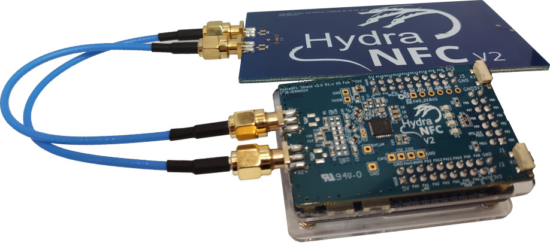

HydraFW official firmware for HydraBus v1/HydraNFC Shield v2
========

HydraFW is a native C (and asm) open source firmware for HydraBus board with support of HydraNFC Shield v2.
This specific firmware for HydraBus v1/HydraNFC Shield v2 is a fork of https://github.com/hydrabus/hydrafw commit [1cce35acc76758828e4d3a16139fb7899804acbb](https://github.com/hydrabus/hydrafw/commit/1cce35acc76758828e4d3a16139fb7899804acbb) 

You can Buy HydraBus v1/HydraNFC Shield v2 Online: http://hydrabus.com/buy-online

HydraNFC Shield v2 is shield for [HydraBus v1](https://hydrabus.com/products) and it is based on [STMicroelectronics ST25R3916 NFC chipset](https://www.st.com/en/nfc/st25r3916.html) which is today the most powerful and versatile NFC chipset available on the market.

HydraNFC Shield v2 shall be plugged on top of HydraBus v1 with a dedicated open source firmware (but it can also be used with any other MCU).

HydraNFC Shield v2 is for anyone interested in Learning/Developping/Debugging/Hacking/Penetration Testing for basic or advanced NFC communications.

Summary of HydraNFC Shield v2 hardware features:
* NFC Reader/writer, NFC Card emulation, NFC Active and passive peer to peer
* Support NFC-A / ISO14443A up to 848 kbit/s, NFC-B / ISO14443B up to 848 kbit/s, NFC-F / FeliCa up to 424 kbit/s, NFC-V / ISO15693 up to 53 kb/s, NFC-A / ISO14443A and NFC-F / FeliCa card emulation
* 1.6W output power at 5V with Differential Antenna and Variable capacitors for NFC Automatic antenna tuning (AAT)
* Low level mode to implement MIFARE Classic compliant or other custom protocols, Automatic gain control and squelch feature to maximize SNR
* Measurement of antenna voltage amplitude and phase, RSSI, on-chip supply and regulated voltages

This firmware is fully open source and based on HydraFW and is specific to HydraBus v1 with HydraNFC Shield v2 it use [STMicroelectronics RFAL for ST25R3916](https://www.st.com/content/st_com/en/products/embedded-software/st25-nfc-rfid-software/stsw-st25rfal002.html)

For more details on key features of HydraNFC Shield v2 hardware & firmware see https://hydrabus.com/hydranfc-shield-v2-specifications

See also Wiki https://github.com/hydrabus/hydrafw_hydranfc_shield_v2/wiki

### Documentation
* [HydraFW-HydraNFC-v2-guide](https://github.com/hydrabus/hydrafw_hydranfc_shield_v2/wiki/HydraFW-HydraNFC-v2-guide)

### How to Help
  * [HydraFW-HydraNFC-v2-guide](https://github.com/hydrabus/hydrafw_hydranfc_shield_v2/wiki/HydraFW-HydraNFC-v2-guide)
  * [Task List](https://github.com/hydrabus/hydrafw_hydranfc_shield_v2/wiki/Task-List)
  * [Report Issues/Features](https://github.com/hydrabus/hydrafw_hydranfc_shield_v2/issues)
  * For developers see also [Coding style](https://github.com/hydrabus/hydrafw_hydranfc_shield_v2/blob/master/CODING_STYLE.md)
